# Taxonomy of Evaluations

Evaluation is not monolithic. The landscape of LLM evaluation varies along multiple critical dimensions. Understanding these dimensions is essential for designing evaluations that answer your specific questions and avoid mismatches between your evaluation methodology and your actual needs.

This chapter maps the space of possible evaluations and provides guidance on when to use each approach.

## Intrinsic vs. Extrinsic Evaluations

### Intrinsic Evaluation

Intrinsic evaluations measure model capabilities in isolation, without deploying the model in a task-specific application.

**Characteristics:**
- Focused on inherent model properties (knowledge, reasoning, alignment)
- Decontextualized from downstream applications
- Often automated, using reference-based or reference-free metrics
- Fast and low-cost
- Can be run on standardized benchmarks

**Examples:**
- MMLU (broad knowledge across domains)
- HumanEval (code generation capability)
- TruthfulQA (factuality and hallucination tendency)
- HellaSwag (common sense reasoning)
- Toxicity evaluation (harmful output propensity)

**Advantages:**
- Consistent, reproducible, and comparable across models
- Isolates specific capabilities for deep analysis
- Early signal during development (e.g., during fine-tuning)
- Efficient for screening candidate models

**Limitations:**
- May not predict real-world performance
- Decontextualized nature misses application-specific challenges
- Benchmark saturation means differences between models are small
- Doesn't capture user experience or business outcomes

**When to use:** Early in development, for capability assessment, for model comparison when all else is equal, as baseline signals before task-specific evaluation.

### Extrinsic Evaluation

Extrinsic evaluations measure model performance in the context of specific, often downstream applications.

**Characteristics:**
- Task-specific, measuring how well the model solves a real problem
- Often includes application-specific success criteria
- Can be automated (if task outcomes are measurable) or require human judgment
- Slower and more expensive than intrinsic evaluation
- May use proprietary or domain-specific datasets

**Examples:**
- Customer support ticket resolution rate (for a support chatbot)
- Code compilation and test pass rate (for a code generation system)
- User satisfaction ratings (for a conversational system)
- Clinical validity scores (for a medical recommendation system)
- Information retrieval effectiveness (for a RAG system)

**Advantages:**
- Directly measures what matters: business outcomes and user experience
- Reveals task-specific failure modes and edge cases
- Stronger correlation with real-world success
- Captures application-specific context and constraints

**Limitations:**
- More expensive and slower than intrinsic evaluation
- Can be noisy (especially with small samples)
- May require proprietary data (hard to publish results)
- Difficult to compare across organizations

**When to use:** Before production deployment, for final model selection, for continuous monitoring in production, for generating evidence of real-world utility.

**Best practice:** Combine both. Use intrinsic evaluation for screening and rapid iteration. Use extrinsic evaluation for final validation and production monitoring.

## Static vs. Dynamic vs. Live Benchmarks

### Static Benchmarks

Static benchmarks are fixed, pre-published datasets. The evaluation set is fixed at the time the benchmark is released.

**Characteristics:**
- Finite, static dataset (e.g., MMLU has 57,000 questions)
- Same evaluation set used across models and time periods
- Publicly available, enabling reproducible comparisons
- Subject to contamination (models trained on benchmark data)

**Examples:**
- MMLU, ARC, HellaSwag, GSM8K, HumanEval
- SQuAD, Natural Questions (for QA)
- MATH, AMC (for math reasoning)

**Advantages:**
- Reproducibility: any model can be evaluated on the same set
- Leaderboards: comparative rankings across models
- Standardization: common benchmark reduces evaluation variance
- Simplicity: straightforward to implement and report

**Limitations:**
- Contamination: models trained on public benchmarks inflate scores
- Saturation: frontier models score 85-95%, limiting differentiation
- Fixed scope: doesn't capture emerging capabilities or new domains
- Gaming: models can be optimized specifically for the benchmark

**When to use:** For model comparison, for research publication, for establishing baselines, as one signal among multiple evaluations.

### Dynamic Benchmarks

Dynamic benchmarks generate new evaluation tasks on-the-fly, maintaining a fresh evaluation set.

**Characteristics:**
- Tasks are generated procedurally (e.g., synthetic questions from templates)
- New tasks on each evaluation run
- Harder to contaminate (constantly changing)
- Requires careful design to ensure task distribution is consistent

**Examples:**
- AGEN (procedurally generated reading comprehension)
- Custom synthetic evaluation sets generated from templates
- Probing tasks that vary by model and time

**Advantages:**
- Harder to contaminate (new tasks constantly generated)
- Unlimited scale (generate as many tasks as compute allows)
- Fresh evaluation signal (not optimized for by frontier models)
- Can be adapted to new domains/capabilities

**Limitations:**
- Less standardized (harder to compare across implementations)
- Task distribution must be carefully controlled
- Generation process must be defensible and reproducible
- Smaller community consensus on methodology

**When to use:** When contamination is a concern, for continuous evaluation where you need fresh signal, for domain-specific evaluation where you can generate synthetic tasks.

### Live Benchmarks (Arena Benchmarks)

Live benchmarks pit models against each other in an ongoing competition, using diverse human-generated queries.

**Characteristics:**
- Models are evaluated against real user queries collected continuously
- Rankings based on preference modeling (e.g., Elo rating, Bradley-Terry)
- Asynchronous human evaluation or preference annotation
- Evolves as new models and queries arrive

**Examples:**
- Chatbot Arena (LLM Chat)
- BEE Arena (Code)
- Image-related arenas for multimodal models
- Proprietary internal arenas maintained by large organizations

**Advantages:**
- Evaluated on real-world queries from actual users
- Difficulty/diversity increases as new queries arrive
- Preference-based ranking avoids absolute score inflation
- Captures nuanced differences between models
- Public leaderboards enable continuous competition

**Limitations:**
- Biased by evaluator pool (often ML researchers rather than diverse users)
- Annotation quality varies (single annotation per query, no disagreement analysis)
- Slower to produce results (asynchronous, human evaluation)
- Leaderboard noise from random pairings
- Not all queries map to published research (hard to reproduce)

**When to use:** For public-facing model comparison, for continuous signal on emerging models, for understanding relative model quality across diverse tasks.

## Human vs. Automated vs. Hybrid Evaluation

### Automated Evaluation

Automated evaluation uses programmatic methods (metrics, classifiers, language models) to score model outputs without human involvement.

**Characteristics:**
- Fast, scalable, reproducible
- Metrics are explicit and implementable
- No human variability
- Often imperfect correlation with human judgment

**Approaches:**
- Reference-based metrics (BLEU, ROUGE, METEOR, chrF++ for text generation)
- Learned metrics (BERTScore, COMET for NMT)
- Classifier-based (toxicity classifiers, factuality classifiers)
- LLM-as-judge (using another LLM to score outputs)

**Advantages:**
- Cheap and fast
- Perfectly reproducible
- No human annotation bottleneck
- Enables large-scale evaluation

**Limitations:**
- Often misaligned with human judgment
- Captures only what metrics explicitly measure
- Blind spots for nuanced quality
- Can be gamed (models learn to optimize for metrics, not quality)

**When to use:** For continuous monitoring, for rapid iteration during development, for expensive-to-evaluate tasks where metrics have high human correlation, as baseline signal before human evaluation.

### Human Evaluation

Human evaluation uses human annotators to judge model outputs.

**Characteristics:**
- Slow and expensive
- Subjective (annotators may disagree)
- Best alignment with user experience
- Often the gold standard

**Approaches:**
- Rating scales (e.g., "How helpful is this response?" 1-5)
- Pairwise comparison (e.g., "Which response is better?")
- Rubric-based evaluation (e.g., checklist of criteria)
- Free-form commentary (e.g., "Describe what's wrong with this response")

**Advantages:**
- Best correlation with real user satisfaction
- Captures nuanced quality dimensions
- Detects subtle failure modes
- Evaluators can explain their judgments

**Limitations:**
- Expensive (typically $0.10-$2.00 per annotation depending on complexity)
- Slow (bottleneck on evaluation iteration)
- Subjective and sometimes inconsistent (inter-rater reliability is critical)
- Biased by annotator pool
- Not reproducible (each annotation is unique)

**When to use:** For final validation before deployment, for safety evaluation (especially for adversarial robustness), for generating training data for automated metrics, for understanding why models fail.

**Best practice for human evaluation:**
- Recruit diverse annotators (different backgrounds, expertise levels)
- Use clear rubrics and examples
- Collect multiple annotations per example (typically 3-5) to measure agreement
- Report inter-rater reliability (Cohen's kappa or Krippendorff's alpha)
- Train annotators before evaluation
- Audit annotations for quality (check for annotator drift over time)

### Hybrid Evaluation

Hybrid approaches combine automated and human evaluation for efficiency and accuracy.

**Approaches:**

1. **Automated screening + human verification:** Use automated metrics to flag low-quality outputs, then have humans verify the findings.

2. **LLM-as-judge + human agreement:** Use an LLM judge to score outputs, then have humans spot-check a sample and measure agreement.

3. **Automated baseline + human comparative evaluation:** Use metrics to establish baselines, then use human evaluation only for model pairs where automated metrics disagree or produce close scores.

4. **Human-in-the-loop calibration:** Use a small human-evaluated sample (e.g., 100 examples) to calibrate automated metrics, then apply metrics to large-scale evaluation.

**Advantages:**
- Combines speed/cost of automation with accuracy of human judgment
- Reduces annotation cost (humans only evaluate high-uncertainty cases)
- Can measure automation-human agreement

**Limitations:**
- Requires careful design to avoid cascading errors
- Complexity of combining signals
- Still expensive compared to pure automation

**When to use:** For balanced trade-offs between speed, cost, and accuracy; for large-scale evaluation where pure human evaluation is infeasible.

## Capability vs. Safety vs. Alignment Evaluations

### Capability Evaluation

Capability evaluation measures what a model can do: its knowledge, reasoning, language understanding, coding ability, etc.

**Scope:**
- What tasks can the model perform?
- How well does it perform them?
- On which tasks/domains does it excel or struggle?

**Methods:**
- Benchmark performance (MMLU, HumanEval, HellaSwag, etc.)
- Task-specific evaluation (customer support, medical diagnosis, etc.)
- Capability probing (e.g., "Can this model do few-shot in-context learning?")

**Metrics:**
- Accuracy, F1, BLEU, ROUGE, METEOR (task-dependent)
- Pass rates (e.g., "What fraction of code can be compiled?")
- Skill-specific metrics

**When to use:** During development, for model selection, for understanding what a model can do before deployment.

### Safety Evaluation

Safety evaluation measures whether a model can produce harmful outputs or be misused.

**Scope:**
- Can the model be jailbroken or adversarially attacked?
- Does it produce toxic, biased, or discriminatory outputs?
- Can it be misused for harmful purposes (instruction generation, deception, etc.)?
- How reliably does it refuse harmful requests?

**Methods:**
- Adversarial prompting (attempting to jailbreak or circumvent refusals)
- Toxicity and bias evaluation (using classifiers or human annotation)
- Red teaming (hiring adversaries to find ways to misuse the model)
- Testing on known adversarial datasets

**Metrics:**
- Jailbreak success rate
- Refusal consistency (does the model always refuse harmful requests or inconsistently?)
- Toxicity score (from classifiers like Perspective API)
- Bias metrics (statistical fairness metrics across demographic groups)

**When to use:** Before production deployment (mandatory), for continuous monitoring in production, for regulatory compliance, for safety-critical applications.

### Alignment Evaluation

Alignment evaluation measures whether the model's behavior is consistent with intended values and constraints.

**Scope:**
- Does the model follow instructions reliably?
- Does it exhibit the intended behavior and constraints?
- Are its outputs consistent with specified values (e.g., helpfulness, honesty, harmlessness)?
- Does it correctly handle edge cases and constraint violations?

**Methods:**
- Testing instruction following (do outputs match specified constraints?)
- Value probing (do outputs reflect intended values?)
- Consistency testing (does the model behave consistently across similar scenarios?)
- Red teaming for alignment (do adversarial prompts reveal misalignment?)

**Metrics:**
- Instruction adherence rate
- Consistency score (fraction of consistent responses across similar prompts)
- Value alignment metrics (e.g., alignment with RLHF training objectives)

**When to use:** Throughout development (fine-tuning, RLHF), before deployment, for continuous verification that model behavior remains aligned.

## Pre-Deployment vs. Continuous Evaluation

### Pre-Deployment Evaluation

Pre-deployment evaluation happens before a model is released to production. It is a one-time (or periodic) assessment.

**Characteristics:**
- High-stakes (gate for production)
- Comprehensive (aims to be complete)
- Often expensive and time-consuming
- Produces reports and documentation

**Scope:**
- Capability evaluation across relevant domains
- Safety evaluation including adversarial robustness
- Alignment evaluation to ensure intended behavior
- Task-specific evaluation for application context

**Timeline:**
- Pre-release assessment (before model shipping)
- Pre-deployment assessment (before internal rollout)
- Pre-production assessment (before customer-facing deployment)

**Documentation:**
- Evaluation report with methodology, results, confidence intervals, limitations
- Risk assessment identifying potential failure modes
- Recommendations for safe deployment

**When to use:** Always, for any production system. Non-negotiable.

### Continuous Evaluation

Continuous evaluation happens after production deployment, monitoring model performance over time.

**Characteristics:**
- Lower-cost, automated or semi-automated
- Continuous feedback loop (detects degradation quickly)
- Monitors for data drift, model degradation, and emerging issues
- Enables rapid response to problems

**Metrics:**
- Task-specific performance metrics (accuracy, latency, business outcome)
- Automated safety metrics (toxicity flags, jailbreak detection)
- User satisfaction (ratings, feedback, support tickets)
- System health (latency, error rates, uptime)

**Frequency:**
- Real-time (every batch of inferences)
- Daily (aggregated metrics)
- Weekly (trend analysis)
- Monthly (drift detection)

**Actions triggered:**
- Alerts when performance degradation is detected
- Automated rollback if severe degradation occurs
- Retraining or model update if systematic issues are found

**When to use:** Essential for any production system. Non-negotiable companion to pre-deployment evaluation.

## Point-in-Time vs. Longitudinal Evaluation

### Point-in-Time Evaluation

Point-in-time evaluation assesses model performance at a specific moment (e.g., at release, during a benchmark run).

**Characteristics:**
- Single snapshot of performance
- Answers "How good is the model as of March 2026?"
- Easiest to report and compare

**Use cases:**
- Model comparison (which model is best right now?)
- Benchmarking against published baselines
- Release evaluation (is the model ready to ship?)

**Limitations:**
- Doesn't capture performance evolution
- Can't detect trends or degradation over time
- Single evaluation runs have high variance

### Longitudinal Evaluation

Longitudinal evaluation tracks model performance over time, capturing trends and drift.

**Characteristics:**
- Multiple evaluations over time (weeks, months, years)
- Answers "How is the model's performance evolving?"
- Detects trends, seasonal patterns, and degradation

**Use cases:**
- Tracking performance evolution across versions
- Detecting data drift and distribution shift
- Measuring impact of fine-tuning or training updates
- Long-term safety monitoring (e.g., detecting emerging failure modes)

**Analysis:**
- Trend lines (is performance improving, degrading, or stable?)
- Variance analysis (how much does performance fluctuate?)
- Correlation with external factors (do scores correlate with input distribution changes?)

**Benefits:**
- Detects slow degradation that point-in-time evaluation misses
- Enables proactive action before critical thresholds are crossed
- Provides richer signal for debugging (e.g., "performance degraded when we added data from domain X")

---

## Evaluation Taxonomy Diagram

This diagram captures the major dimensions of evaluation variation:

```mermaid
graph TD
    A["LLM Evaluation"] --> B["Intrinsic vs Extrinsic"]
    A --> C["Static vs Dynamic vs Live"]
    A --> D["Human vs Automated vs Hybrid"]
    A --> E["Capability vs Safety vs Alignment"]
    A --> F["Pre-deployment vs Continuous"]
    A --> G["Point-in-Time vs Longitudinal"]

    B --> B1["Intrinsic<br/>Knowledge, reasoning<br/>No task context"]
    B --> B2["Extrinsic<br/>Task performance<br/>Real application"]

    C --> C1["Static Benchmark<br/>Fixed dataset<br/>Risk: contamination"]
    C --> C2["Dynamic Benchmark<br/>Generated tasks<br/>Fresh signal"]
    C --> C3["Live Arena<br/>Real queries<br/>Preference-based"]

    D --> D1["Automated<br/>Fast, cheap<br/>Metric-based"]
    D --> D2["Human<br/>Best alignment<br/>Expensive"]
    D --> D3["Hybrid<br/>Cost-accuracy<br/>Balanced"]

    E --> E1["Capability<br/>What can model do?"]
    E --> E2["Safety<br/>Can it harm?"]
    E --> E3["Alignment<br/>Does it match intent?"]

    F --> F1["Pre-deployment<br/>Gate for release<br/>Comprehensive"]
    F --> F2["Continuous<br/>Production monitoring<br/>Automated"]

    G --> G1["Point-in-Time<br/>Single snapshot<br/>Comparable"]
    G --> G2["Longitudinal<br/>Trends over time<br/>Drift detection"]

    style A fill:#e1f5ff
    style B1 fill:#fff9c4
    style B2 fill:#fff9c4
    style C1 fill:#c8e6c9
    style C2 fill:#c8e6c9
    style C3 fill:#c8e6c9
    style D1 fill:#f8bbd0
    style D2 fill:#f8bbd0
    style D3 fill:#f8bbd0
    style E1 fill:#ffe0b2
    style E2 fill:#ffe0b2
    style E3 fill:#ffe0b2
    style F1 fill:#d1c4e9
    style F2 fill:#d1c4e9
    style G1 fill:#b2dfdb
    style G2 fill:#b2dfdb
```

## Designing Your Evaluation Strategy

When designing an evaluation strategy, consider:

1. **What decision are you making?** (Model selection, capability assessment, deployment readiness, etc.)

2. **Intrinsic or extrinsic?** Are benchmark scores sufficient, or do you need task-specific evaluation?

3. **Static, dynamic, or live?** Does your use case require published benchmarks (reproducibility) or fresh signal (avoiding contamination)?

4. **Human, automated, or hybrid?** What's your budget (in time and money) and accuracy requirements?

5. **Capability, safety, or alignment?** Which dimensions matter most for your system?

6. **Pre-deployment, continuous, or both?** What's the minimum evaluation needed for safe deployment?

7. **Point-in-time or longitudinal?** Is a single evaluation sufficient or do you need trend detection?

**Best practice:** Combine multiple dimensions. A robust evaluation strategy typically includes:

- **Capability:** Intrinsic benchmark + extrinsic task-specific evaluation
- **Safety:** Pre-deployment red teaming + continuous automated safety monitoring
- **Alignment:** Pre-deployment instruction following + continuous consistency checks
- **Frequency:** One-time comprehensive pre-deployment + continuous lightweight monitoring

---

**Next:** Learn about [the metrics available for evaluation](./metrics-deep-dive.md) and when to use each one.
