# LLM Evaluation Benchmark Landscape Overview

## Introduction

The landscape of LLM evaluation benchmarks in March 2026 has matured dramatically, with specialized evaluations covering every major capability dimension. This document provides a comprehensive map of 80+ active benchmarks organized by evaluation category, establishing a "periodic table of LLM benchmarks" that helps practitioners select appropriate evaluation tools for their models and use cases.

## Benchmark Categorization

LLM evaluations fall into 12 major categories, each addressing distinct capability dimensions:

### 1. Knowledge & Reasoning Benchmarks
Assess broad knowledge and reasoning abilities across diverse domains.

| Benchmark | Type | Domain | Scale | Current Leader | Top Score |
|-----------|------|--------|-------|-----------------|-----------|
| MMLU | Multiple choice | 57 domains | 15,908 questions | Gemini 3.1 Pro | 95.3% |
| MMLU-Pro | Multiple choice | 57 domains | 12,000 questions | Gemini 3 Pro | 89.8% |
| GPQA Diamond | Multiple choice | Science | 1,531 questions | Gemini 3.1 Pro | 94.1% |
| Humanity's Last Exam | Multiple choice | Science/Liberal Arts | 1,000 questions | Gemini 3.1 Pro | 44.7% |
| BFCL | Open-ended | General knowledge | - | Claude Opus 4.5 | ~88% |

### 2. Mathematical Reasoning Benchmarks
Evaluate capability to solve mathematical problems at varying difficulty levels.

| Benchmark | Type | Difficulty | Scale | Current Leader | Top Score |
|-----------|------|------------|-------|-----------------|-----------|
| GSM8K | Word problems | Elementary | 8,792 items | Saturated | ~96% |
| MATH | Competition problems | Advanced | 12,500 items | GPT-5 | ~90%+ |
| AIME 2025/2026 | Competition problems | Olympiad | 30 items/year | GPT-5 | 100% (verified) |
| FrontierMath | Research-level | Research | Tier 1-3 | Frontier Models | 40%+ (Tier 1) |

### 3. Code Generation & Software Engineering Benchmarks
Assess programming capability from simple generation to complex system understanding.

| Benchmark | Type | Scope | Current Leader | Top Score |
|-----------|------|-------|-----------------|-----------|
| HumanEval | Function implementation | 164 problems | Saturated | >90% |
| SWE-bench Verified | Real GitHub issues | 500+ issues | Claude Opus 4.5 | 80.9% |
| LiveCodeBench | Monthly programming | Diverse | Frontier Models | ~75%+ |
| BigCodeBench | Comprehensive | 1,139 problems | GPT-5 | ~85%+ |
| MBPP | Python functions | 974 problems | Claude Opus 4.5 | ~88% |

### 4. Instruction Following & Chat Benchmarks
Measure adherence to complex instructions and conversational quality.

| Benchmark | Type | Evaluation | Current Leader | Top Score |
|-----------|------|------------|-----------------|-----------|
| IFEval | Constraint satisfaction | Automatic | Kimi K2.5 | 94.0% |
| IFEval-FC | Function calling variant | Automatic | Frontier Models | ~91%+ |
| MM-IFEval | Multimodal instructions | Automatic | Gemini 3.1 Pro | ~88%+ |
| AlpacaEval 2.0 | LLM-as-judge | Comparative | Claude Opus 4.5 | ~92% |
| MT-Bench | Multi-turn | LLM-as-judge | GPT-5 | ~9.2/10 |

### 5. Long Context Window Benchmarks
Evaluate information retrieval and reasoning across extended contexts (8K-2M words).

| Benchmark | Type | Max Length | Current Leader | Top Score |
|-----------|------|-----------|-----------------|-----------|
| LongBench v2 | QA & retrieval | 8K-2M words | Frontier Models | ~85%+ |
| RULER | Synthetic needles | 32K-256K tokens | Gemini 3.1 Pro | ~99%+ |
| NIAH | Needle in hay | 64K-2M tokens | Claude Opus 4.5 | ~98%+ |
| LV-Eval | Long-form | 4K-32K tokens | Gemini 3.1 Pro | ~92% |
| L-CiteEval | Citation accuracy | Long-form | Claude Opus 4.5 | ~89% |

### 6. Multimodal Benchmarks
Assess vision-language capabilities across images, charts, and complex visual reasoning.

| Benchmark | Type | Modality | Scale | Current Leader | Top Score |
|-----------|------|----------|-------|-----------------|-----------|
| MMBench | Visual QA | Images | 1,168 items | Gemini 3.1 Pro | 88.9% |
| OCRBench v2 | Optical character | Text-in-image | 1,500+ | Gemini 3.1 Pro | 87.2% |
| MMMU | Multimodal | Diverse domains | 11,500 items | Gemini 3.1 Pro | 78.4% |
| VQAv2 | Visual QA | Real images | 204K items | Gemini 3.1 Pro | 86.5% |
| AVA-Bench | Audio-visual | Video + audio | - | Frontier Models | ~72%+ |

### 7. Agentic & Tool Use Benchmarks
Evaluate agent capabilities, planning, tool interaction, and real-world task completion.

| Benchmark | Type | Environment | Current Leader | Top Score |
|-----------|------|-------------|-----------------|-----------|
| WebArena | Web navigation | Real websites | Claude Opus 4.5 | ~35% |
| GAIA | General AI | Real-world | GPT-5 | ~92%+ |
| Terminal-Bench Hard | Command line | Shell tasks | Claude Opus 4.5 | ~68% |
| tau2-Bench | Multi-step reasoning | Tool chaining | Frontier Models | ~77%+ |
| FieldWorkArena | Long-horizon | Simulated environment | Claude Opus 4.5 | ~42% |
| AgentClinic | Medical diagnosis | Multi-step diagnostic | Claude Opus 4.5 | ~89% |

### 8. Safety & Alignment Benchmarks
Measure robustness, harmlessness, truthfulness, and alignment with human values.

| Benchmark | Type | Focus | Current Leader | Approach |
|-----------|------|-------|-----------------|----------|
| MLCommons AILuminate v1.0 | Taxonomy | Safety taxonomy | All leaders | Framework |
| Phare | Semantic | Harmful content detection | Claude Opus 4.5 | ~94% precision |
| JBDistill | Jailbreak | Robustness | Frontier Models | ~91% resistance |
| SG-Bench | Generation safety | Red-teaming | Claude Opus 4.5 | ~95% safe |
| CASE-Bench | Context-aware safety | Domain-specific risks | Gemini 3.1 Pro | ~88% |

### 9. Multilingual Benchmarks
Assess language capabilities across 20-250+ languages with culturally appropriate contexts.

| Benchmark | Type | Languages | Current Leader | Top Score |
|-----------|------|-----------|-----------------|-----------|
| MMLU-ProX | Multiple choice | 29 languages | GPT-5 | ~88%+ (avg) |
| Global-MMLU-Lite | Multiple choice | 50+ languages | Frontier Models | ~82% (avg) |
| MMTEB | Embeddings | 250+ languages | Gemini Embedding 001 | 68.32% avg |
| TurkBench | Diverse tasks | 10+ underserved langs | Claude Opus 4.5 | ~80% (avg) |
| Alder Polyglot | Code generation | 40+ languages | GPT-5 | ~76% |

### 10. Retrieval-Augmented Generation (RAG) Benchmarks
Evaluate information retrieval, knowledge synthesis, and citation accuracy in RAG pipelines.

| Benchmark | Type | Focus | Current Leader | Top Score |
|-----------|------|-------|-----------------|-----------|
| RAGBench | Multi-stage retrieval | QA with retrieval | Claude Opus 4.5 | ~84% |
| CRAG | Retrieval challenges | Adversarial retrieval | Frontier Models | ~78%+ |
| LegalBench-RAG | Domain-specific | Legal documents | GPT-5 | ~91%+ |
| T2-RAGBench | Table-to-text | Tabular retrieval | Gemini 3.1 Pro | ~86% |

### 11. Embedding & Retrieval Benchmarks
Measure semantic understanding through embedding tasks and information retrieval.

| Benchmark | Type | Tasks | Scale | Current Leader | Top Score |
|-----------|------|-------|-------|-----------------|-----------|
| MTEB | Retrieval, clustering | 56 tasks | 112 languages | Gemini Embedding 001 | 68.32% |
| MMTEB | Multilingual embeddings | 131 tasks | 250+ languages | Frontier Models | ~71%+ |

### 12. Live & Dynamic Benchmarks
Continuously updated evaluations that measure progress over time.

| Benchmark | Type | Update Frequency | Current Leader | Features |
|-----------|------|------------------|-----------------|----------|
| LiveBench | Monthly challenges | Monthly releases | Frontier Models | ~75%+ |
| ARC-AGI-3 | Reasoning puzzles | Continuous | All frontier <1% | Single-answer format |

## Comprehensive Benchmark Map Diagram

```mermaid
graph TB
    LLMEval["LLM Evaluation Benchmarks<br/>March 2026"]

    LLMEval --> Knowledge["Knowledge & Reasoning"]
    LLMEval --> Math["Mathematical Reasoning"]
    LLMEval --> Code["Code & SE"]
    LLMEval --> Instruction["Instruction Following"]
    LLMEval --> LongCtx["Long Context"]
    LLMEval --> Multimodal["Multimodal"]
    LLMEval --> Agentic["Agentic"]
    LLMEval --> Safety["Safety & Alignment"]
    LLMEval --> Multilingual["Multilingual"]
    LLMEval --> RAG["RAG"]
    LLMEval --> Embeddings["Embeddings"]
    LLMEval --> Live["Live & Dynamic"]

    Knowledge --> MMLU["MMLU<br/>95.3%"]
    Knowledge --> MMLUPro["MMLU-Pro<br/>89.8%"]
    Knowledge --> GPQA["GPQA Diamond<br/>94.1%"]
    Knowledge --> HLE["Humanity's Last Exam<br/>44.7%"]

    Math --> GSM8K["GSM8K<br/>~96%"]
    Math --> MATH["MATH<br/>~90%+"]
    Math --> AIME["AIME<br/>100%"]
    Math --> Frontier["FrontierMath<br/>40%+"]

    Code --> HumanEval["HumanEval<br/>Saturated >90%"]
    Code --> SWEBench["SWE-bench<br/>80.9%"]
    Code --> LiveCode["LiveCodeBench<br/>~75%+"]
    Code --> BigCode["BigCodeBench<br/>~85%+"]

    Instruction --> IFEval["IFEval<br/>94.0%"]
    Instruction --> MMIFEval["MM-IFEval<br/>~88%+"]
    Instruction --> MTBench["MT-Bench<br/>9.2/10"]

    LongCtx --> LongBench["LongBench v2<br/>~85%+"]
    LongCtx --> RULER["RULER<br/>~99%+"]
    LongCtx --> NIAH["NIAH<br/>~98%+"]

    Multimodal --> MMBench["MMBench<br/>88.9%"]
    Multimodal --> OCR["OCRBench v2<br/>87.2%"]
    Multimodal --> MMMU["MMMU<br/>78.4%"]

    Agentic --> WebArena["WebArena<br/>~35%"]
    Agentic --> GAIA["GAIA<br/>~92%+"]
    Agentic --> TerminalBench["Terminal-Bench<br/>~68%"]

    Safety --> AILuminate["MLCommons AILuminate"]
    Safety --> Phare["Phare<br/>~94%"]
    Safety --> JBDistill["JBDistill<br/>~91%"]

    Multilingual --> MMluProX["MMLU-ProX<br/>~88%+"]
    Multilingual --> GlobalMMlu["Global-MMLU-Lite<br/>~82%"]
    Multilingual --> MMTEB["MMTEB<br/>131 tasks"]

    RAG --> RAGBench["RAGBench<br/>~84%"]
    RAG --> CRAG["CRAG<br/>~78%+"]

    Embeddings --> MTEB["MTEB<br/>68.32%"]
    Embeddings --> MMTEB2["MMTEB<br/>~71%+"]

    Live --> LiveBench["LiveBench<br/>~75%+"]
    Live --> ARCAGI["ARC-AGI-3<br/><1%"]
```

## Key Observations - March 2026

### Saturation Trends
- **Saturated benchmarks** (>95% performance): GSM8K, HumanEval basic variants
- **Near-saturation** (>90%): MMLU (95.3%), GPQA Diamond (94.1%), IFEval (94.0%)
- **Approaching saturation**: MMLU-Pro (89.8%), SWE-bench Verified (80.9%)

### Frontier Challenges
Benchmarks where even the most advanced models struggle:
- **ARC-AGI-3**: All frontier models <1% success rate - true reasoning frontier
- **FrontierMath**: Only 40%+ on Tier 1 problems - mathematical reasoning frontier
- **Humanity's Last Exam**: Only 44.7% - integrated knowledge frontier
- **WebArena**: Only ~35% - autonomous web navigation frontier

### Emerging Gaps
Areas requiring further benchmark development:
- Long-horizon agentic planning (>100-step tasks)
- Real-time multimodal processing
- Cross-lingual knowledge transfer
- Domain-specific specialized evaluation (medical, legal, scientific)

## Benchmark Selection Guide

### For General-Purpose Model Evaluation
Use: MMLU, MMLU-Pro, GSM8K, HumanEval, IFEval
These provide the most comprehensive capability profile.

### For Reasoning-Heavy Applications
Use: GPQA Diamond, MATH, Humanity's Last Exam, FrontierMath, ARC-AGI-3
These test deeper reasoning over breadth.

### For Production Systems
Use: SWE-bench Verified, WebArena, RAGBench, CRAG, LongBench v2
These reflect real-world constraints and complexity.

### For Specialized Domains
Use: LegalBench-RAG (legal), AgentClinic (medical), AVA-Bench (multimodal), MMMU (diverse domains)

### For Research
Use: LiveBench, CRAG, FrontierMath, ARC-AGI-3, tau2-Bench
These track frontier capabilities and evolving challenges.

## Leaderboard Leaders - Current Champions

**Frontier Models** (March 2026):
- **GPT-5**: AIME (100%), MATH (~90%+), BigCodeBench (~85%+), GAIA (~92%+)
- **Gemini 3.1 Pro**: MMLU (95.3%), GPQA Diamond (94.1%), MMBench (88.9%), Humanity's Last Exam (44.7%)
- **Claude Opus 4.5**: SWE-bench Verified (80.9%), Terminal-Bench Hard (~68%), AgentClinic (~89%), WebArena (~35%)
- **Kimi K2.5**: IFEval (94.0%)

## Benchmark Coverage Metrics

For comprehensive evaluation, aim to cover:
- **Knowledge breadth**: 1-2 benchmarks (MMLU or MMLU-Pro)
- **Mathematical reasoning**: 1-2 benchmarks (GSM8K + MATH or AIME)
- **Code capability**: 2 benchmarks (HumanEval + SWE-bench or LiveCodeBench)
- **Instruction following**: 1 benchmark (IFEval or AlpacaEval)
- **Long context**: 1 benchmark (LongBench v2 or NIAH)
- **Multimodal**: 1-2 benchmarks if applicable (MMBench, MMMU)
- **Agentic**: 1-2 benchmarks for agent systems (WebArena, GAIA, or Terminal-Bench)
- **Safety**: Minimum 1 (MLCommons AILuminate framework assessment)
- **Domain-specific**: 1-2 relevant benchmarks for target use case
- **Live tracking**: Subscribe to LiveBench monthly for trend monitoring

## Metadata and Version Control

This benchmark landscape is current as of **March 31, 2026** based on leaderboard data from:
- Official benchmark repositories and leaderboards
- Published research papers (AIME 2025-2026, FrontierMath, Humanity's Last Exam)
- Model card documentation from Anthropic, Google, OpenAI, and other organizations
- Monthly LiveBench releases

Benchmark methodologies and scoring evolve continuously. Always reference the official benchmark documentation and latest leaderboard results for authoritative performance metrics.
